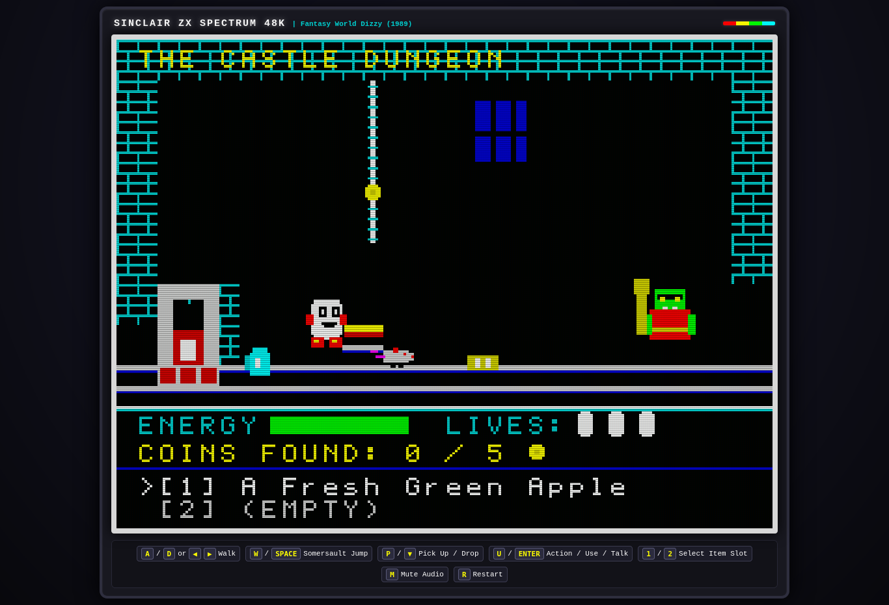

# 🥚 Fantasy World Dizzy (1989) — ZX Spectrum Classic



### 🌐 [Play Live Demo on GitHub Pages](https://kothf.github.io/fantasy-world-dizzy/)

An authentic, self-contained HTML5 Canvas and vanilla JavaScript playable recreation of the opening chapter of the legendary 1989 Sinclair ZX Spectrum adventure **"Fantasy World Dizzy" (Dizzy III)** by Philip and Andrew Oliver (The Oliver Twins).

Built from scratch with zero external dependencies, images, or audio files — the entire game, graphics, font, sound synthesizer, and physics engine run inside a single standalone `index.html`.

---

## 🌟 Features & Retro Authenticity

### 1. 📺 Sinclair ZX Spectrum 48K Audiovisual Fidelity
- **Native 256×192 Resolution:** Rendered to an internal 256×192 pixel buffer with CSS integer scaling (`image-rendering: pixelated`) and authentic 4:3 CRT aspect ratio.
- **Sinclair 15-Color Palette:** Strict enforcement of the Sinclair ZX Spectrum color palette (8 standard colors + bright intensity variants).
- **8×8 Attribute Cell Clashing:** Platform scenery, masonry, and background elements conform to Sinclair 8×8 attribute block ink and paper styling.
- **Embedded ZX Spectrum ROM Font:** Full 8×8 bitmapped character set embedded in JavaScript for crisp retro typography and dialogue boxes.

### 2. 🔊 1-Bit Web Audio API Synthesizer
- **Zero External Audio Files:** All sound effects are generated in real-time via square waves, noise generators, and pitch envelopes replicating the Sinclair 48K beeper chip.
- **Sound Catalog:**
  - Iconic jump chirps & landing click
  - Coin collection dings
  - Typewriter dialogue blips
  - Steam hiss (extinguishing the fireplace)
  - Lever ratchet & gear crank
  - Descending death buzz & hurt squeak
  - 3-note Oliver Twins signature chime & victory fanfare

### 3. 🏃 Authentic Dizzy Physics & Movement
- **Signature Somersault Jump:** Dizzy rotates 360° mid-air during jumps.
- **Landing Stumble Roll:** Forward momentum causes Dizzy to roll upon landing before regaining his footing.
- **Climbing System:** Fluid climbing mechanics on chains (Dungeon) and ladders (Cavern) using Up/Down controls.
- **Fall Hazard & Daze:** High falls cause daze recovery and energy depletion.

### 4. 🏰 4 Interconnected Flip-Screen Rooms
- **Room 0: The Castle Dungeon:** Starting room with a roaring fireplace pit, Troll Guard, hungry rat, wooden barrel, climbable chain, and Gold Coin #1.
- **Room 1: Behind the Fireplace:** Secret cavern unlocked by dousing the fire; features hanging stalactites, wooden ladder, a massive granite boulder, and Gold Coin #2.
- **Room 2: The Entrance Hall:** Grand stone staircase, balcony balustrade, wall lever mechanism, heavy iron portcullis, sturdy rope, Gold Coin #3, and Gold Coin #4.
- **Room 3: The Castle Moat:** Broken drawbridge over lethal waters, *Snap Happy Gator*, lush green bank, and Gold Coin #5. Crossing with all coins triggers victory!

### 5. 🎒 Inventory System & Authentic Puzzles
- **2-Slot Inventory:** Authentic item capacity with active slot swapping, ground drops, and pickups.
- **Classic Puzzles:**
  - 🍏 Bribe the Troll Guard with the fresh red apple.
  - 🏺 Extinguish the fireplace fire pit with the cold water jug.
  - 🍞 Feed the hungry rat stale bread so it scurries away.
  - ⚙️ Flip the wall switch to raise the portcullis gate.
  - 🪢 Tie the *Snap Happy Gator's* snout shut with the sturdy rope to use it as a stepping stone.
  - 🪙 Collect all 5 hidden Gold Coins to win.

---

## 🕹️ Controls

Full support for modern keyboard layouts, classic ZX Spectrum key schemes, and on-screen touch/gamepad controls for mobile devices:

| Action | Modern Keyboard | Classic ZX Spectrum | Touch / Mobile |
| :--- | :--- | :--- | :--- |
| **Walk Left** | `←` Left Arrow or `A` | `O` | **[ ◄ ]** Button |
| **Walk Right** | `→` Right Arrow or `D` | `P` | **[ ► ]** Button |
| **Jump / Somersault** | `↑` Up Arrow or `W` | `Q` | **[ JUMP ]** Button |
| **Climb Down** | `↓` Down Arrow or `S` | `A` | **[ ▼ ]** Button |
| **Interact / Advance Dialog** | `Space` or `Enter` | `Space` | **[ USE ]** Button |
| **Pick Up / Drop Item** | `E` or `G` | `Q` (on ground) | **[ PICK/DROP ]** Button |
| **Switch Active Item Slot** | `Tab` or `1` / `2` | `T` | **[ SLOT ]** Button |
| **Toggle Sound Mute** | `M` | `M` | Audio Header Icon |
| **Restart Game** | `R` | `R` | **[ RESTART ]** Button |

---

## 🚀 How to Run Locally

Because the project is completely self-contained with no external dependencies or build pipelines, you can run it immediately:

### Option 1: Direct File Open
Simply double-click `index.html` in your file explorer, or open it directly in any modern browser:
```bash
xdg-open index.html
# or
firefox index.html
# or
google-chrome index.html
```

### Option 2: Local HTTP Server
```bash
python3 -m http.server 8080
```
Then navigate to `http://localhost:8080` in your browser.

---

## 📜 Credits & Tribute

Created as a loving homage to **Philip and Andrew Oliver (The Oliver Twins)** and **Codemasters**, who defined a golden era of British 8-bit home computing with the *Dizzy* series.
